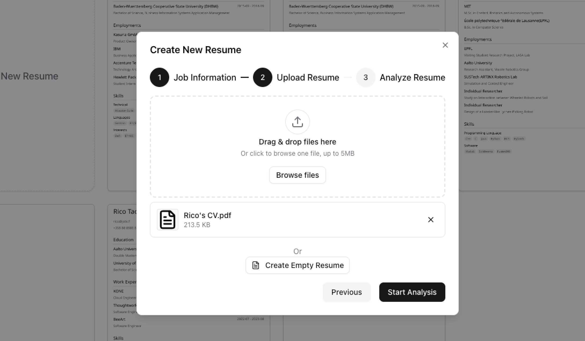
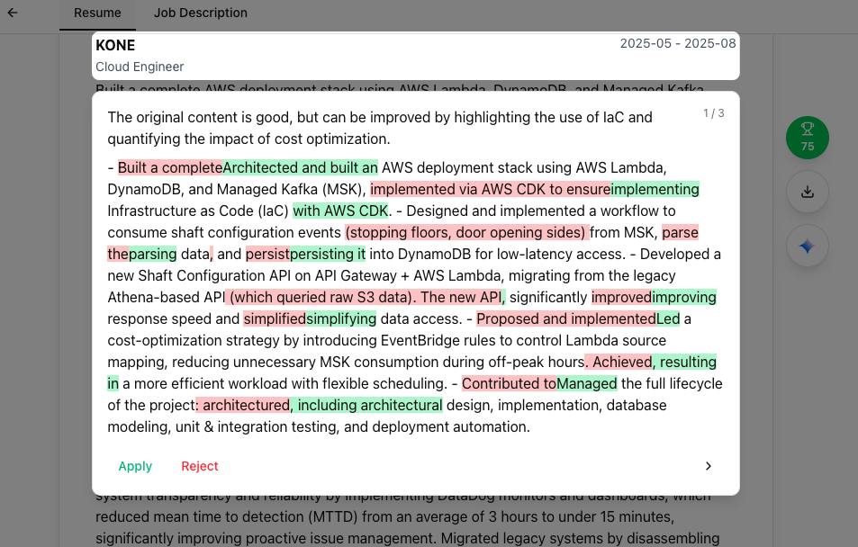
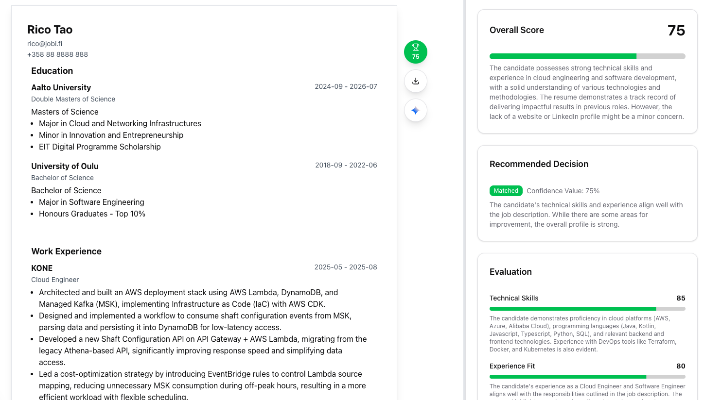

# Jobi

[简体中文](README.zh-CN.md)

<p align="center">
  
</p>

Jobi is a self-hostable, AI-assisted workspace for managing job applications and resumes. It brings application tracking, PDF resume import and structured editing, job-specific tailoring, resume evaluation, and PDF export into one workflow while leaving deployment and provider choices under the operator's control.

## Preview

### Import a resume



### Keep your experience authentic



### Tailor it to the role



## Features

- Track job applications from a central dashboard.
- Import a PDF resume or start with an empty structured resume.
- Edit personal information, education, employment, research, projects, publications, awards, certifications, and skills.
- Store a job description alongside each application and tailor resume content with AI-assisted chat.
- Generate and refresh an evaluation to review the resume against the associated role.
- Export the finished resume as a PDF.
- Switch the interface between English and Chinese.
- Self-host the application and connect your own database, authentication, storage, and external-service accounts.

AI suggestions and evaluations are aids for review, not guarantees of hiring outcomes or objective measures of employability.

## Tech stack

- [Next.js 15](https://nextjs.org/) App Router and React 19
- TypeScript, Tailwind CSS v4, shadcn/ui, and Radix
- Jotai, React Hook Form, and Zod
- Supabase for authentication, database, and storage
- Vercel AI SDK with the direct DeepSeek provider
- OpenNext and Cloudflare Workers for deployment
- Vitest and Playwright for testing

## Getting started

### Prerequisites

- Node.js `24.15.0`
- [pnpm](https://pnpm.io/)
- A Docker-compatible runtime
- [Supabase CLI](https://supabase.com/docs/guides/local-development/cli/getting-started)

### Local setup

Use the repository's pinned Node.js version and install dependencies:

```bash
nvm use
pnpm install
```

Create the local environment file, start Supabase, apply migrations and seed data, then start Jobi:

```bash
cp .env.example .env.local
supabase start
supabase db reset
pnpm dev
```

Open [http://localhost:3000](http://localhost:3000). Payments and analytics are not required for the basic local workflow. AI-assisted features require the DeepSeek settings described below.

For environment-specific workflows and troubleshooting, see the [development guide](docs/development.md).

## Configuration

Copy `.env.example` to `.env.local` and replace placeholders only for the integrations you enable. `.env.example` is the canonical inventory of current variable names.

### Required Supabase settings

| Variable | Visibility | Purpose |
| --- | --- | --- |
| `NEXT_PUBLIC_SUPABASE_URL` | Public | Supabase project URL |
| `NEXT_PUBLIC_SUPABASE_PUBLISHABLE_KEY` | Public | Browser-safe Supabase publishable key |
| `SUPABASE_SECRET_KEY` | Server only | Privileged Supabase access for trusted server code |

`NEXT_PUBLIC_BASE_URL` is the public application origin, such as `http://localhost:3000`. `NEXT_PUBLIC_ENVIRONMENT` is an optional public marker used for staging; set it to `staging` only in that environment.

### AI provider

Jobi's configured AI provider is DeepSeek:

| Variable | Visibility | Purpose |
| --- | --- | --- |
| `DEEPSEEK_API_KEY` | Server only | DeepSeek API credential |
| `DEEPSEEK_MODEL_ID` | Server only | Model identifier; the example defaults to `deepseek-v4-flash` |

### Optional payments

The repository includes Stripe and Paddle integrations. They are optional for basic local development, but their checkout, webhook, and access-pass flows require the complete provider-specific configuration.

Stripe uses these server-only variables:

- `STRIPE_SECRET_KEY`
- `STRIPE_WEBHOOK_SECRET`
- `STRIPE_LITE_PASS_PRICE_ID`
- `STRIPE_PRO_PASS_PRICE_ID`

Paddle uses:

- Server only: `PADDLE_API_KEY`, `PADDLE_WEBHOOK_SECRET`, `PADDLE_LITE_PRICE_ID`, `PADDLE_PRO_PRICE_ID`
- Public: `NEXT_PUBLIC_PADDLE_CLIENT_TOKEN`, `NEXT_PUBLIC_PADDLE_ENV`, `NEXT_PUBLIC_PADDLE_LITE_PRICE_ID`, `NEXT_PUBLIC_PADDLE_PRO_PRICE_ID`

Use test or sandbox credentials outside production.

### Optional analytics

Umami analytics is disabled when its configuration is absent:

- `NEXT_PUBLIC_UMAMI_WEBSITE_ID`
- `NEXT_PUBLIC_UMAMI_SCRIPT_URL`

Variables prefixed with `NEXT_PUBLIC_` are bundled into browser code and can be read by users. Never place secrets in public variables. Keep service keys, API keys, and webhook secrets server-only, and never commit `.env.local` or real credentials.

See [docs/development.md](docs/development.md) for detailed environment, Cloudflare, provider, and migration guidance.

## Self-hosting

Jobi is designed to be operated with your own Supabase project and provider accounts. The included deployment path targets Cloudflare Workers through OpenNext. A complete deployment needs:

- environment-specific public variables and server secrets;
- a Supabase project with the repository's migrations applied and authentication redirects configured;
- a Cloudflare Worker with the required OpenNext bindings;
- the `MYBROWSER` Browser Rendering binding for PDF export;
- DeepSeek credentials if AI features are enabled;
- provider-specific webhook and checkout configuration only when payments are enabled.

Keep local, staging, and production credentials, databases, callback URLs, payment modes, and analytics sites separate. Validate a staging deployment before production. See the [development guide](docs/development.md) and [Cloudflare Workers Builds guide](docs/cloudflare-workers-builds.md) for the maintained deployment details.

## Privacy and data responsibility

Resumes and AI conversations may contain personal or sensitive data. Each operator is responsible for the privacy, security, retention, deletion, subprocessors, cross-border transfers, access controls, and local-law obligations of their deployment.

Before processing real personal data, review the policies and data-handling practices of every enabled AI, storage, analytics, and payment provider. Self-hosting Jobi does not by itself make a deployment compliant with GDPR or any other privacy framework.

## Development and testing

Run the standard quality checks before submitting a general change:

```bash
pnpm lint
pnpm format:check
pnpm test --run
pnpm build
```

Use targeted Vitest projects while developing, and run Playwright for changes that affect primary UI flows:

```bash
pnpm test --project server --run
pnpm test --project components --run
pnpm e2e-test-headless
```

The [development guide](docs/development.md) documents local services, Supabase migrations, Cloudflare validation, test selection, and deployment commands.

## Contributing

Contributions are welcome. Before making a substantial change:

1. Read the [development guide](docs/development.md) and relevant documents in [`docs/`](docs/).
2. Open an issue to discuss the scope and intended approach.
3. Keep changes focused and include appropriate tests or documentation.
4. Run the quality checks above before opening a pull request.

## License

Jobi is licensed under the [GNU Affero General Public License v3.0 (AGPL-3.0)](LICENSE).
